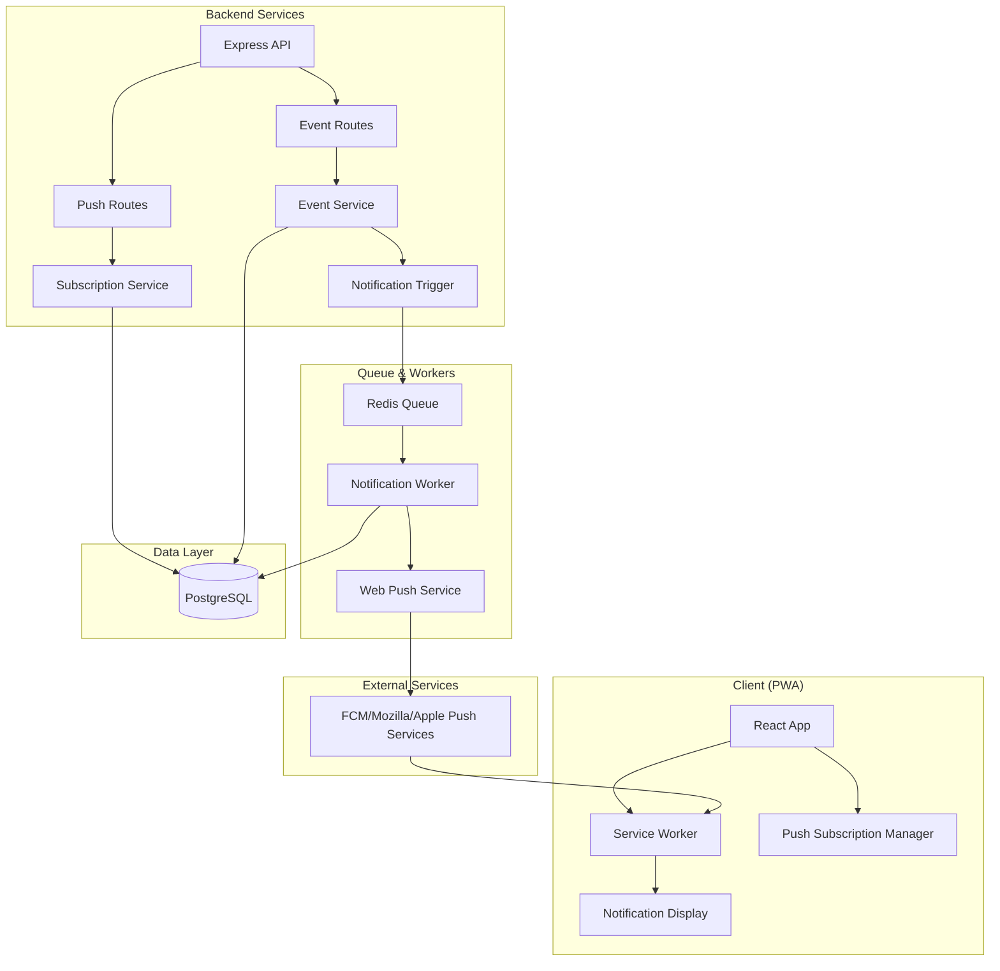

# Design Document

## Overview

The PWA Push Notifications system implements a comprehensive Web Push notification infrastructure for the iWent platform. The system uses VAPID (Voluntary Application Server Identification) protocol to send notifications to users about event changes and new events. The architecture consists of client-side subscription management, server-side notification processing with Redis queuing, and background workers for scalable fan-out delivery.

The system integrates with the existing iWent architecture, extending the current Prisma database schema and Express.js backend while enhancing the React PWA frontend with push notification capabilities.

## Architecture

### High-Level Architecture



### Data Flow

1. **Subscription Flow**: User grants permission → PWA registers with push service → Subscription stored in database
2. **Event Change Flow**: Event updated → Notification job queued → Worker fetches ticket holders → Push notifications sent
3. **Notification Display Flow**: Push service delivers → Service worker receives → Notification displayed → User interaction handled

## Components and Interfaces

### 1. Database Schema Extensions

The existing Prisma schema will be extended with a new `PushSubscription` model:

```prisma
model PushSubscription {
  id         String   @id @default(uuid())
  userId     String
  endpoint   String   @unique
  p256dh     String
  auth       String
  userAgent  String?
  enabled    Boolean  @default(true)
  createdAt  DateTime @default(now())
  lastSeenAt DateTime @default(now())
  user       User     @relation(fields: [userId], references: [id], onDelete: Cascade)
  
  @@index([userId, enabled])
  @@index([endpoint])
}

// Add to User model
model User {
  // ... existing fields
  pushSubscriptions PushSubscription[]
}
```

### 2. Backend API Components

#### Push Subscription Service
```typescript
interface PushSubscriptionService {
  createSubscription(userId: string, subscription: PushSubscriptionData): Promise<void>
  updateSubscription(endpoint: string, subscription: PushSubscriptionData): Promise<void>
  disableSubscription(endpoint: string): Promise<void>
  getUserSubscriptions(userId: string): Promise<PushSubscription[]>
  cleanupInvalidSubscription(endpoint: string): Promise<void>
}

interface PushSubscriptionData {
  endpoint: string
  keys: {
    p256dh: string
    auth: string
  }
  expirationTime?: number | null
}
```

#### Notification Service
```typescript
interface NotificationService {
  sendEventUpdateNotification(eventId: string, changeType: EventChangeType, changeData: any): Promise<void>
  sendNewEventNotification(eventId: string): Promise<void>
  queueNotificationJob(jobData: NotificationJobData): Promise<void>
}

interface NotificationJobData {
  type: 'event_update' | 'new_event'
  eventId: string
  payload: NotificationPayload
  targetUsers?: string[]
}

interface NotificationPayload {
  type: string
  eventId: string
  title: string
  body: string
  url: string
  icon?: string
  badge?: string
  actions?: NotificationAction[]
  change?: ChangeDetails
}
```

#### Web Push Service
```typescript
interface WebPushService {
  sendNotification(subscription: PushSubscriptionData, payload: NotificationPayload, options?: PushOptions): Promise<void>
  sendBulkNotifications(subscriptions: PushSubscriptionData[], payload: NotificationPayload): Promise<BulkSendResult>
}

interface PushOptions {
  ttl?: number
  urgency?: 'very-low' | 'low' | 'normal' | 'high'
  topic?: string
}

interface BulkSendResult {
  sent: number
  failed: number
  invalidEndpoints: string[]
}
```

### 3. Frontend Components

#### Push Subscription Manager
```typescript
interface PushSubscriptionManager {
  requestPermission(): Promise<NotificationPermission>
  subscribe(): Promise<PushSubscription | null>
  unsubscribe(): Promise<boolean>
  getSubscription(): Promise<PushSubscription | null>
  isSupported(): boolean
}
```

#### Notification Permission UI
```typescript
interface NotificationPermissionProps {
  onPermissionGranted: () => void
  onPermissionDenied: () => void
}

interface NotificationSettingsProps {
  userId: string
  currentSettings: NotificationPreferences
  onSettingsChange: (settings: NotificationPreferences) => void
}
```

### 4. Worker Components

#### Notification Worker
```typescript
interface NotificationWorker {
  processEventUpdateJob(job: Job<EventUpdateJobData>): Promise<JobResult>
  processNewEventJob(job: Job<NewEventJobData>): Promise<JobResult>
  fetchTargetSubscriptions(eventId: string, notificationType: string): Promise<PushSubscriptionData[]>
  sendNotificationsWithConcurrency(subscriptions: PushSubscriptionData[], payload: NotificationPayload): Promise<BulkSendResult>
}

interface JobResult {
  sent: number
  failed: number
  invalidEndpoints: string[]
  processingTime: number
}
```

## Data Models

### Push Subscription Model
```typescript
interface PushSubscription {
  id: string
  userId: string
  endpoint: string
  p256dh: string
  auth: string
  userAgent?: string
  enabled: boolean
  createdAt: Date
  lastSeenAt: Date
}
```

### Notification Payload Model
```typescript
interface NotificationPayload {
  type: 'event_update' | 'new_event'
  eventId: string
  title: string
  body: string
  url: string
  icon?: string
  badge?: string
  actions?: NotificationAction[]
  change?: {
    field: string
    oldValue: any
    newValue: any
  }
}

interface NotificationAction {
  action: string
  title: string
  icon?: string
}
```

### Event Change Tracking
```typescript
interface EventChangeData {
  eventId: string
  changeType: 'time_change' | 'venue_change' | 'cancellation' | 'new_event'
  changes: {
    field: string
    oldValue: any
    newValue: any
  }[]
  timestamp: Date
}
```

## Error Handling

### Client-Side Error Handling
1. **Permission Denied**: Graceful degradation with alternative notification methods
2. **Subscription Failed**: Retry mechanism with exponential backoff
3. **Service Worker Registration Failed**: Fallback to polling for critical updates

### Server-Side Error Handling
1. **Invalid Push Subscriptions**: Automatic cleanup of 404/410 endpoints
2. **Rate Limiting**: Exponential backoff and retry for 429 responses
3. **Payload Size Limits**: Automatic payload trimming for 413 responses
4. **Queue Failures**: Dead letter queue for failed jobs with manual retry capability

### Error Response Codes
- `404/410`: Subscription no longer valid → Remove from database
- `413`: Payload too large → Trim payload and retry
- `429`: Rate limited → Exponential backoff
- `500`: Server error → Retry with backoff

## Testing Strategy

### Unit Tests
1. **Push Subscription Service**: Test CRUD operations and validation
2. **Notification Service**: Test payload generation and job queuing
3. **Web Push Service**: Mock external push services and test error handling
4. **Worker Logic**: Test job processing and concurrency limits

### Integration Tests
1. **End-to-End Notification Flow**: From event change to notification delivery
2. **Subscription Management**: Full subscription lifecycle testing
3. **Error Recovery**: Test cleanup of invalid subscriptions
4. **Queue Processing**: Test Redis queue operations and worker coordination

### Manual Testing Checklist
1. **Cross-Browser Compatibility**: Test on Chrome, Firefox, Safari, Edge
2. **Mobile PWA Testing**: Test on iOS Safari (16.4+) and Android browsers
3. **Permission Flow**: Test grant/deny scenarios
4. **Notification Display**: Test various payload types and actions
5. **Offline Behavior**: Test notification queuing when offline

### Performance Testing
1. **Bulk Notification Sending**: Test with 1000+ subscriptions
2. **Queue Performance**: Test job processing under load
3. **Database Performance**: Test subscription queries with large datasets
4. **Memory Usage**: Monitor worker memory consumption during bulk sends

## Security Considerations

### VAPID Key Management
- Private keys stored server-side only in environment variables
- Public keys exposed through secure API endpoint
- Key rotation strategy for compromised keys

### Subscription Security
- All subscriptions tied to authenticated users
- Endpoint validation to prevent subscription hijacking
- Rate limiting on subscription endpoints

### Payload Security
- No PII in notification payloads
- Payload size limits to prevent abuse
- Content sanitization for user-generated content

### API Security
- Authentication required for all push-related endpoints
- CSRF protection on state-changing operations
- Rate limiting on notification trigger endpoints

## Performance Optimizations

### Database Optimizations
- Indexes on frequently queried fields (userId, enabled, eventId)
- Pagination for large subscription lists
- Connection pooling for high-concurrency scenarios

### Queue Optimizations
- Concurrency limits to prevent overwhelming push services
- Job prioritization for time-sensitive notifications
- Batch processing for bulk operations

### Caching Strategy
- Cache VAPID public key
- Cache user notification preferences
- Cache event data for notification generation

### Monitoring and Metrics
- Track notification delivery rates
- Monitor queue processing times
- Alert on high failure rates
- Track subscription growth and churn