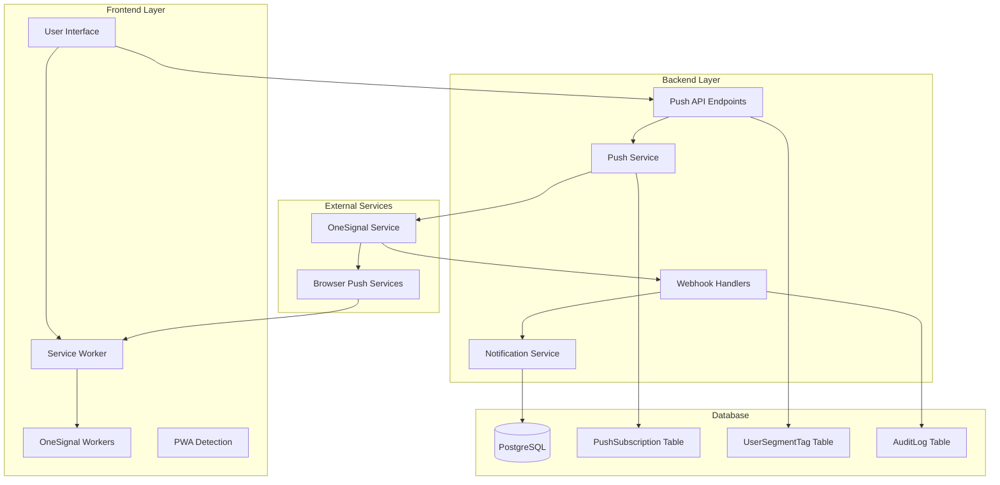
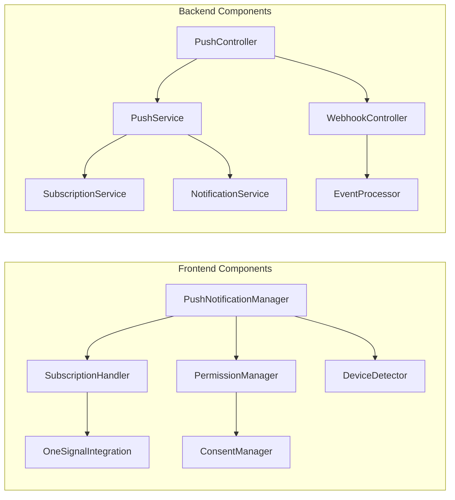
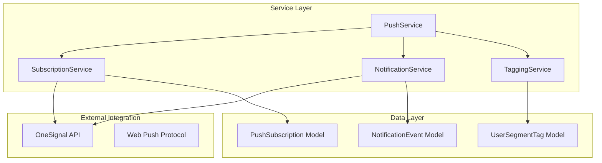
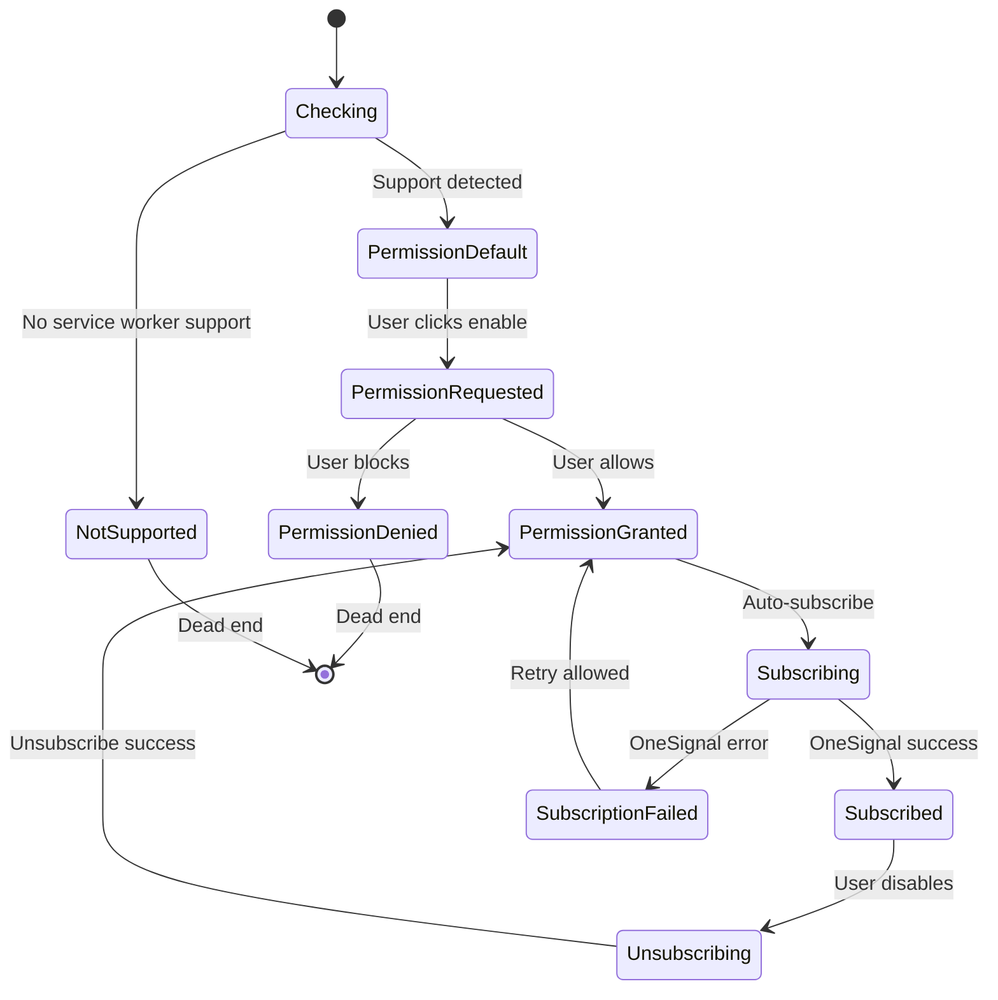

# Push Notification Module Design

## Overview
This document outlines the design for implementing a comprehensive push notification system using OneSignal v16 SDK for the bilet-demo platform. The system will enable real-time notifications for events, ticket updates, and user interactions across web browsers and PWA installations.

## Technology Stack & Dependencies
- **OneSignal SDK**: Web v16 for push notification delivery
- **Service Workers**: Background notification handling with OneSignalSDKWorker.js
- **Express.js**: Backend API endpoints for webhook management
- **Prisma ORM**: Database schema integration with existing models
- **Zod**: Input validation for API endpoints
- **TypeScript**: Type safety across frontend and backend
- **HTTPS Required**: OneSignal requires HTTPS for all web push functionality
- **Same-Origin Policy**: Separate OneSignal apps needed for different domains/subdomains

## Architecture

### Component Architecture


### Component Definition
| Component | Responsibility | Technology |
|-----------|----------------|------------|
| **OneSignal SDK** | Client-side subscription management | JavaScript v16 |
| **Service Workers** | Background notification handling | Browser APIs |
| **Push API** | Subscription CRUD operations | Express.js + Zod |
| **Webhook Handler** | OneSignal event processing | Express.js |
| **Push Service** | Notification delivery logic | Node.js + Axios |
| **Notification Service** | Business logic for notifications | TypeScript |

### Component Hierarchy


### Props/State Management
- **Frontend State**: React Context for subscription status, permissions, device info
- **Backend State**: Database-persisted subscription data with OneSignal integration
- **Lifecycle Methods/Hooks**: useEffect for initialization, service worker registration

### Example Component Usage
```typescript
// Frontend Usage
const { isSubscribed, subscribe, unsubscribe } = usePushNotifications();

// Backend Usage
await PushService.sendNotification(userId, {
  title: 'Event Reminder',
  body: 'Your event starts in 1 hour!',
  url: '/events/123'
});
```

## Routing & Navigation
### API Endpoints Reference

#### Push Subscription Management
```typescript
// Subscription Management
POST   /api/v1/push/sync           // Sync OneSignal subscription with backend
GET    /api/v1/push/subscription   // Get user subscription details
PUT    /api/v1/push/subscription   // Update subscription metadata
DELETE /api/v1/push/subscription   // Remove subscription

// Device and Tag Management
POST   /api/v1/push/tags          // Update user tags
GET    /api/v1/push/devices       // Get user devices
POST   /api/v1/push/device/sync   // Sync device information

// Admin Endpoints
POST   /api/v1/admin/push/send    // Send test notification
GET    /api/v1/admin/push/stats   // Get notification statistics
GET    /api/v1/admin/push/users   // List subscribed users
```

#### OneSignal Webhooks
```typescript
// Webhook endpoints for OneSignal events
POST /api/v1/onesignal/display     // Notification displayed
POST /api/v1/onesignal/clicked     // Notification clicked  
POST /api/v1/onesignal/dismissed   // Notification dismissed

// Health check
GET  /api/v1/admin/push/health     // System health status
```

### Authentication Requirements
- **User Authentication**: JWT token required for subscription management
- **Admin Authentication**: Admin role required for test sending and statistics
- **Webhook Authentication**: OneSignal signature verification (HMAC)

### Request/Response Schema
```typescript
// Subscription Sync Request (POST /api/v1/push/sync)
interface SyncSubscriptionRequest {
  onesignalUserId: string;      // OneSignal player_id
  browser: Browser;             // CHROME, SAFARI, FIREFOX, EDGE, OTHER
  os: OS;                       // IOS, ANDROID, MACOS, WINDOWS, LINUX, OTHER
  deviceType: DeviceType;       // DESKTOP, MOBILE, TABLET
  pwa: boolean;                 // Is PWA installation
  subscriptionHash?: string;    // Optional: hash of subscription endpoint
}

// Tag Update Request (POST /api/v1/push/tags)
interface UpdateTagsRequest {
  tags: Record<string, string>; // Key-value pairs for user segmentation
}

// Admin Send Request (POST /api/v1/admin/push/send)
interface AdminSendRequest {
  target: {
    userId?: string;            // Send to specific user
    externalId?: string;        // Send to external ID
    tags?: Record<string, string>; // Send to users with tags
  };
  notification: {
    title: string;
    body: string;
    url?: string;               // Click action URL
    icon?: string;              // Notification icon
    badge?: string;             // Badge icon
    data?: Record<string, any>; // Custom data
  };
}

// OneSignal Webhook Event (POST /api/v1/onesignal/*)
interface OneSignalWebhookEvent {
  app_id: string;
  player_id: string;
  user_id?: string;             // External ID if set
  timestamp: number;
  notification: {
    id: string;
    title: string;
    body: string;
    url?: string;
    icon?: string;
    data?: Record<string, any>;
  };
  custom_data?: Record<string, any>;
}

// API Response Formats
interface SubscriptionResponse {
  id: string;
  userId: string;
  onesignalUserId: string;
  browser: Browser;
  os: OS;
  deviceType: DeviceType;
  pwa: boolean;
  subscribed: boolean;
  lastSeen?: string;
  createdAt: string;
  updatedAt: string;
}

interface NotificationStatsResponse {
  totalSubscriptions: number;
  activeSubscriptions: number;
  totalSent: number;
  totalDelivered: number;
  totalClicked: number;
  clickThroughRate: number;
  byPlatform: {
    web: number;
    pwa: number;
  };
  byBrowser: Record<Browser, number>;
  byOS: Record<OS, number>;
}
```

## Data Models & ORM Mapping

### Enhanced PushSubscription Model
```typescript
// Enhanced schema based on OneSignal v16 requirements
model PushSubscription {
  id              String     @id @default(cuid())
  userId          String
  channel         PushChannel @default(WEB_PUSH)
  onesignalUserId String     // OneSignal player_id (required)
  onesignalSubId  String?    // OneSignal subscription_id (optional)
  subscriptionHash String?   // Hashed endpoint for security
  browser         Browser
  os              OS
  deviceType      DeviceType
  pwa             Boolean
  subscribed      Boolean    @default(true)
  lastSeen        DateTime?  // Last activity timestamp
  ipAddress       String?    // Last known IP (hashed for privacy)
  userAgent       String?    // User agent string (truncated)
  createdAt       DateTime   @default(now())
  updatedAt       DateTime   @updatedAt
  user            User       @relation(fields: [userId], references: [id], onDelete: Cascade)

  @@index([userId, browser, os, deviceType, pwa])
  @@index([onesignalUserId])
  @@index([subscribed, lastSeen])
  @@unique([userId, onesignalUserId]) // One subscription per user per OneSignal device
}

// Enhanced UserSegmentTag for OneSignal targeting
model UserSegmentTag {
  id        String        @id @default(cuid())
  userId    String
  key       String        // Tag key (e.g., "env", "city", "interests", "user_type")
  value     String        // Tag value (e.g., "dev", "istanbul", "concerts", "premium")
  source    SegmentSource // INTERNAL or ONESIGNAL
  syncedAt  DateTime?     // Last sync with OneSignal
  createdAt DateTime      @default(now())
  updatedAt DateTime      @updatedAt
  user      User          @relation(fields: [userId], references: [id], onDelete: Cascade)

  @@index([userId, key, value])
  @@index([key, value]) // For segmentation queries
  @@unique([userId, key, source]) // One tag value per key per source
}

// New model for tracking notification events
model NotificationEvent {
  id              String    @id @default(cuid())
  userId          String?
  onesignalId     String    // OneSignal notification ID
  onesignalUserId String?   // OneSignal player_id
  eventType       String    // "sent", "delivered", "display", "click", "dismiss"
  timestamp       DateTime  @default(now())
  metadata        Json?     // Additional event data
  ipAddress       String?   // Event source IP (hashed)
  userAgent       String?   // User agent (truncated)
  user            User?     @relation(fields: [userId], references: [id], onDelete: SetNull)

  @@index([userId, eventType, timestamp])
  @@index([onesignalId, eventType])
  @@index([onesignalUserId, eventType])
  @@index([timestamp]) // For analytics queries
}

// Enhanced enums
enum PushChannel {
  WEB_PUSH        // Web push notifications
  // Future: EMAIL_PUSH, SMS_PUSH for multi-channel
}

enum Browser {
  CHROME
  SAFARI
  FIREFOX
  EDGE
  OPERA
  OTHER
}

enum OS {
  IOS
  ANDROID
  MACOS
  WINDOWS
  LINUX
  CHROME_OS
  OTHER
}

enum DeviceType {
  DESKTOP
  MOBILE
  TABLET
}

enum SegmentSource {
  INTERNAL        // Tags managed by our application
  ONESIGNAL       // Tags synced from OneSignal
  EXTERNAL        // Tags from external integrations
}
```

### UserSegmentTag Model (Existing)
```typescript
// Used for OneSignal targeting
model UserSegmentTag {
  id      String        @id @default(cuid())
  userId  String
  key     String        // Tag key (e.g., "env", "city", "interests")
  value   String        // Tag value (e.g., "dev", "istanbul", "concerts")
  source  SegmentSource // INTERNAL or ONESIGNAL
  user    User          @relation(fields: [userId], references: [id], onDelete: Cascade)

  @@index([userId, key, value])
}
```

### Notification Event Models
```typescript
// New models for notification tracking
model NotificationEvent {
  id             String    @id @default(cuid())
  userId         String
  onesignalId    String    // OneSignal notification ID
  type           String    // display, click, dismiss
  timestamp      DateTime  @default(now())
  metadata       Json?     // Additional event data
  user           User      @relation(fields: [userId], references: [id], onDelete: Cascade)

  @@index([userId, type, timestamp])
  @@index([onesignalId])
}
```

## Business Logic Layer

### Push Notification Service Architecture


### Core Features Implementation

#### 1. Subscription Management Service
```typescript
class SubscriptionService {
  async syncSubscription(userId: string, subscriptionData: SyncSubscriptionRequest): Promise<PushSubscription> {
    const existingSubscription = await prisma.pushSubscription.findUnique({
      where: {
        userId_onesignalUserId: {
          userId,
          onesignalUserId: subscriptionData.onesignalUserId
        }
      }
    });
    
    if (existingSubscription) {
      // Update existing subscription
      return await prisma.pushSubscription.update({
        where: { id: existingSubscription.id },
        data: {
          browser: subscriptionData.browser,
          os: subscriptionData.os,
          deviceType: subscriptionData.deviceType,
          pwa: subscriptionData.pwa,
          subscribed: true,
          lastSeen: new Date(),
          updatedAt: new Date()
        }
      });
    } else {
      // Create new subscription
      const subscription = await prisma.pushSubscription.create({
        data: {
          userId,
          onesignalUserId: subscriptionData.onesignalUserId,
          browser: subscriptionData.browser,
          os: subscriptionData.os,
          deviceType: subscriptionData.deviceType,
          pwa: subscriptionData.pwa,
          subscribed: true,
          lastSeen: new Date()
        }
      });
      
      // Set default user tags in OneSignal
      await this.setDefaultUserTags(userId, subscriptionData.onesignalUserId);
      
      return subscription;
    }
  }
  
  async removeSubscription(userId: string, onesignalUserId?: string): Promise<void> {
    const whereClause = onesignalUserId 
      ? { userId_onesignalUserId: { userId, onesignalUserId } }
      : { userId };
    
    await prisma.pushSubscription.updateMany({
      where: whereClause,
      data: {
        subscribed: false,
        updatedAt: new Date()
      }
    });
  }
  
  async getUserSubscriptions(userId: string): Promise<PushSubscription[]> {
    return await prisma.pushSubscription.findMany({
      where: {
        userId,
        subscribed: true
      },
      orderBy: { lastSeen: 'desc' }
    });
  }
  
  async getSubscriptionStats(): Promise<NotificationStatsResponse> {
    const [total, active, byBrowser, byOS, byDeviceType] = await Promise.all([
      prisma.pushSubscription.count(),
      prisma.pushSubscription.count({ where: { subscribed: true } }),
      prisma.pushSubscription.groupBy({
        by: ['browser'],
        where: { subscribed: true },
        _count: { _all: true }
      }),
      prisma.pushSubscription.groupBy({
        by: ['os'],
        where: { subscribed: true },
        _count: { _all: true }
      }),
      prisma.pushSubscription.groupBy({
        by: ['deviceType', 'pwa'],
        where: { subscribed: true },
        _count: { _all: true }
      })
    ]);
    
    // Get notification events stats
    const eventStats = await this.getNotificationEventStats();
    
    return {
      totalSubscriptions: total,
      activeSubscriptions: active,
      ...eventStats,
      byBrowser: byBrowser.reduce((acc, item) => {
        acc[item.browser] = item._count._all;
        return acc;
      }, {} as Record<Browser, number>),
      byOS: byOS.reduce((acc, item) => {
        acc[item.os] = item._count._all;
        return acc;
      }, {} as Record<OS, number>),
      byPlatform: {
        web: byDeviceType.filter(item => !item.pwa).reduce((sum, item) => sum + item._count._all, 0),
        pwa: byDeviceType.filter(item => item.pwa).reduce((sum, item) => sum + item._count._all, 0)
      }
    };
  }
  
  private async setDefaultUserTags(userId: string, onesignalUserId: string): Promise<void> {
    const user = await prisma.user.findUnique({ where: { id: userId } });
    if (!user) return;
    
    const defaultTags = {
      env: process.env.NODE_ENV === 'production' ? 'prod' : 'dev',
      user_type: user.userType.toLowerCase(),
      city: user.city,
      signup_date: user.createdAt.toISOString().split('T')[0], // YYYY-MM-DD
      language: user.locale || 'tr-TR'
    };
    
    // Update OneSignal tags
    await OneSignalService.updatePlayerTags(onesignalUserId, defaultTags);
    
    // Store tags locally
    await TaggingService.updateUserTags(userId, defaultTags);
  }
  
  private async getNotificationEventStats() {
    const thirtyDaysAgo = new Date(Date.now() - 30 * 24 * 60 * 60 * 1000);
    
    const [totalSent, totalDelivered, totalClicked] = await Promise.all([
      prisma.notificationEvent.count({
        where: {
          eventType: 'sent',
          timestamp: { gte: thirtyDaysAgo }
        }
      }),
      prisma.notificationEvent.count({
        where: {
          eventType: 'display',
          timestamp: { gte: thirtyDaysAgo }
        }
      }),
      prisma.notificationEvent.count({
        where: {
          eventType: 'click',
          timestamp: { gte: thirtyDaysAgo }
        }
      })
    ]);
    
    return {
      totalSent,
      totalDelivered,
      totalClicked,
      clickThroughRate: totalDelivered > 0 ? (totalClicked / totalDelivered) * 100 : 0
    };
  }
}
```
```

#### 2. Notification Delivery Service
```typescript
class NotificationService {
  async sendToUser(userId: string, notification: NotificationPayload): Promise<string | null> {
    try {
      // Get user's active subscriptions
      const subscriptions = await SubscriptionService.getUserSubscriptions(userId);
      if (subscriptions.length === 0) {
        throw new Error('User has no active push subscriptions');
      }
      
      // Get user's external ID for targeting
      const user = await prisma.user.findUnique({ where: { id: userId } });
      if (!user) {
        throw new Error('User not found');
      }
      
      // Send via OneSignal using external ID
      const oneSignalPayload = {
        include_aliases: {
          external_id: [user.externalId]
        },
        headings: { en: notification.title },
        contents: { en: notification.body },
        url: notification.url,
        chrome_icon: notification.icon || process.env.DEFAULT_NOTIFICATION_ICON,
        firefox_icon: notification.icon || process.env.DEFAULT_NOTIFICATION_ICON,
        custom_data: notification.data || {}
      };
      
      const notificationId = await OneSignalService.sendNotification(oneSignalPayload);
      
      // Log notification event
      await this.logNotificationEvent({
        userId,
        onesignalId: notificationId,
        eventType: 'sent',
        metadata: { payload: oneSignalPayload }
      });
      
      return notificationId;
    } catch (error) {
      console.error('Failed to send notification to user:', error);
      throw error;
    }
  }
  
  async sendToSegment(segmentFilter: SegmentFilter, notification: NotificationPayload): Promise<string> {
    try {
      // Build OneSignal filter expression from segment criteria
      const filters = this.buildOneSignalFilters(segmentFilter);
      
      const oneSignalPayload = {
        filters,
        headings: { en: notification.title },
        contents: { en: notification.body },
        url: notification.url,
        chrome_icon: notification.icon || process.env.DEFAULT_NOTIFICATION_ICON,
        firefox_icon: notification.icon || process.env.DEFAULT_NOTIFICATION_ICON,
        custom_data: notification.data || {}
      };
      
      const notificationId = await OneSignalService.sendNotification(oneSignalPayload);
      
      // Log segment notification
      await this.logNotificationEvent({
        onesignalId: notificationId,
        eventType: 'sent',
        metadata: { 
          payload: oneSignalPayload,
          segment: segmentFilter
        }
      });
      
      return notificationId;
    } catch (error) {
      console.error('Failed to send notification to segment:', error);
      throw error;
    }
  }
  
  async sendTestNotification(adminId: string, request: AdminSendRequest): Promise<string> {
    try {
      // Validate admin permissions
      const admin = await prisma.user.findUnique({ where: { id: adminId } });
      if (!admin || admin.adminRole === 'USER') {
        throw new Error('Admin access required');
      }
      
      let oneSignalPayload: any = {
        headings: { en: request.notification.title },
        contents: { en: request.notification.body },
        url: request.notification.url,
        chrome_icon: request.notification.icon || process.env.DEFAULT_NOTIFICATION_ICON,
        firefox_icon: request.notification.icon || process.env.DEFAULT_NOTIFICATION_ICON,
        custom_data: request.notification.data || {}
      };
      
      // Set targeting based on request
      if (request.target.userId) {
        const user = await prisma.user.findUnique({ where: { id: request.target.userId } });
        if (!user) throw new Error('Target user not found');
        
        oneSignalPayload.include_aliases = {
          external_id: [user.externalId]
        };
      } else if (request.target.externalId) {
        oneSignalPayload.include_aliases = {
          external_id: [request.target.externalId]
        };
      } else if (request.target.tags) {
        oneSignalPayload.filters = this.buildOneSignalFilters({ tags: request.target.tags });
      } else {
        throw new Error('No valid target specified');
      }
      
      const notificationId = await OneSignalService.sendNotification(oneSignalPayload);
      
      // Log admin action
      await prisma.auditLog.create({
        data: {
          actorId: adminId,
          entity: 'PushNotification',
          entityId: notificationId,
          action: 'SEND_TEST',
          meta: {
            target: request.target,
            notification: request.notification
          }
        }
      });
      
      return notificationId;
    } catch (error) {
      console.error('Failed to send test notification:', error);
      throw error;
    }
  }
  
  private buildOneSignalFilters(segmentFilter: SegmentFilter): any[] {
    const filters: any[] = [];
    
    if (segmentFilter.tags) {
      Object.entries(segmentFilter.tags).forEach(([key, value], index) => {
        if (index > 0) {
          filters.push({ operator: 'AND' });
        }
        filters.push({
          field: 'tag',
          key,
          relation: '=',
          value
        });
      });
    }
    
    if (segmentFilter.city) {
      if (filters.length > 0) filters.push({ operator: 'AND' });
      filters.push({
        field: 'tag',
        key: 'city',
        relation: '=',
        value: segmentFilter.city
      });
    }
    
    if (segmentFilter.userType) {
      if (filters.length > 0) filters.push({ operator: 'AND' });
      filters.push({
        field: 'tag',
        key: 'user_type',
        relation: '=',
        value: segmentFilter.userType.toLowerCase()
      });
    }
    
    return filters;
  }
  
  private async logNotificationEvent(event: {
    userId?: string;
    onesignalId: string;
    onesignalUserId?: string;
    eventType: string;
    metadata?: any;
  }): Promise<void> {
    await prisma.notificationEvent.create({
      data: {
        userId: event.userId,
        onesignalId: event.onesignalId,
        onesignalUserId: event.onesignalUserId,
        eventType: event.eventType,
        metadata: event.metadata
      }
    });
  }
}

// Supporting types
interface NotificationPayload {
  title: string;
  body: string;
  url?: string;
  icon?: string;
  badge?: string;
  data?: Record<string, any>;
}

interface SegmentFilter {
  tags?: Record<string, string>;
  city?: string;
  userType?: string;
  browser?: Browser;
  os?: OS;
  deviceType?: DeviceType;
  pwa?: boolean;
}
```
```

#### 3. Webhook Event Processing Service
```typescript
class WebhookEventProcessor {
  async processDisplayEvent(event: OneSignalWebhookEvent): Promise<void> {
    try {
      // Find user by OneSignal player ID
      const subscription = await prisma.pushSubscription.findFirst({
        where: { onesignalUserId: event.player_id },
        include: { user: true }
      });
      
      // Log display event
      await prisma.notificationEvent.create({
        data: {
          userId: subscription?.userId,
          onesignalId: event.notification.id,
          onesignalUserId: event.player_id,
          eventType: 'display',
          metadata: {
            timestamp: event.timestamp,
            notification: event.notification,
            user_id: event.user_id
          }
        }
      });
      
      // Update subscription last seen
      if (subscription) {
        await prisma.pushSubscription.update({
          where: { id: subscription.id },
          data: { lastSeen: new Date() }
        });
      }
      
      console.log(`Notification ${event.notification.id} displayed to player ${event.player_id}`);
    } catch (error) {
      console.error('Failed to process display event:', error);
      // Don't throw - webhook should still return 200
    }
  }
  
  async processClickEvent(event: OneSignalWebhookEvent): Promise<void> {
    try {
      // Find user by OneSignal player ID
      const subscription = await prisma.pushSubscription.findFirst({
        where: { onesignalUserId: event.player_id },
        include: { user: true }
      });
      
      // Log click event
      await prisma.notificationEvent.create({
        data: {
          userId: subscription?.userId,
          onesignalId: event.notification.id,
          onesignalUserId: event.player_id,
          eventType: 'click',
          metadata: {
            timestamp: event.timestamp,
            notification: event.notification,
            url: event.notification.url,
            user_id: event.user_id
          }
        }
      });
      
      // Update user engagement score (if you have such a system)
      if (subscription?.user) {
        await this.updateUserEngagement(subscription.user.id, 'notification_click');
      }
      
      // Trigger any follow-up actions based on notification type
      await this.handleNotificationClick(event);
      
      console.log(`Notification ${event.notification.id} clicked by player ${event.player_id}`);
    } catch (error) {
      console.error('Failed to process click event:', error);
    }
  }
  
  async processDismissEvent(event: OneSignalWebhookEvent): Promise<void> {
    try {
      // Find user by OneSignal player ID
      const subscription = await prisma.pushSubscription.findFirst({
        where: { onesignalUserId: event.player_id },
        include: { user: true }
      });
      
      // Log dismiss event
      await prisma.notificationEvent.create({
        data: {
          userId: subscription?.userId,
          onesignalId: event.notification.id,
          onesignalUserId: event.player_id,
          eventType: 'dismiss',
          metadata: {
            timestamp: event.timestamp,
            notification: event.notification,
            user_id: event.user_id
          }
        }
      });
      
      // Analyze dismissal patterns for optimization
      await this.analyzeDismissalPattern(event);
      
      console.log(`Notification ${event.notification.id} dismissed by player ${event.player_id}`);
    } catch (error) {
      console.error('Failed to process dismiss event:', error);
    }
  }
  
  private async updateUserEngagement(userId: string, action: string): Promise<void> {
    // Implementation depends on your engagement scoring system
    // Could update user points, track activity, etc.
    try {
      const engagementPoints = this.getEngagementPoints(action);
      
      await prisma.user.update({
        where: { id: userId },
        data: {
          points: {
            increment: engagementPoints
          },
          lastSeenAt: new Date()
        }
      });
    } catch (error) {
      console.error('Failed to update user engagement:', error);
    }
  }
  
  private async handleNotificationClick(event: OneSignalWebhookEvent): Promise<void> {
    // Handle specific notification click actions
    const customData = event.notification.data || {};
    
    switch (customData.type) {
      case 'event_reminder':
        await this.handleEventReminderClick(event, customData);
        break;
      case 'ticket_update':
        await this.handleTicketUpdateClick(event, customData);
        break;
      case 'friend_request':
        await this.handleFriendRequestClick(event, customData);
        break;
      // Add more notification types as needed
    }
  }
  
  private async handleEventReminderClick(event: OneSignalWebhookEvent, data: any): Promise<void> {
    // Track event reminder effectiveness
    if (data.eventId) {
      // Could update event analytics, user preferences, etc.
      console.log(`Event reminder clicked for event ${data.eventId}`);
    }
  }
  
  private async handleTicketUpdateClick(event: OneSignalWebhookEvent, data: any): Promise<void> {
    // Track ticket-related notification engagement
    if (data.ticketId) {
      console.log(`Ticket update clicked for ticket ${data.ticketId}`);
    }
  }
  
  private async handleFriendRequestClick(event: OneSignalWebhookEvent, data: any): Promise<void> {
    // Track social feature engagement
    if (data.friendshipId) {
      console.log(`Friend request notification clicked for friendship ${data.friendshipId}`);
    }
  }
  
  private async analyzeDismissalPattern(event: OneSignalWebhookEvent): Promise<void> {
    // Analyze dismissal patterns to optimize future notifications
    try {
      const recentDismissals = await prisma.notificationEvent.count({
        where: {
          onesignalUserId: event.player_id,
          eventType: 'dismiss',
          timestamp: {
            gte: new Date(Date.now() - 7 * 24 * 60 * 60 * 1000) // Last 7 days
          }
        }
      });
      
      // If user dismisses too many notifications, adjust their targeting
      if (recentDismissals > 5) {
        await this.adjustUserNotificationFrequency(event.player_id, 'reduce');
      }
    } catch (error) {
      console.error('Failed to analyze dismissal pattern:', error);
    }
  }
  
  private async adjustUserNotificationFrequency(playerId: string, action: 'reduce' | 'increase'): Promise<void> {
    // Adjust notification frequency tags in OneSignal
    const frequencyTag = action === 'reduce' ? 'low_frequency' : 'normal_frequency';
    
    try {
      await OneSignalService.updatePlayerTags(playerId, {
        notification_frequency: frequencyTag,
        frequency_updated_at: new Date().toISOString()
      });
    } catch (error) {
      console.error('Failed to adjust user notification frequency:', error);
    }
  }
  
  private getEngagementPoints(action: string): number {
    const pointsMap: Record<string, number> = {
      'notification_click': 5,
      'notification_display': 1,
      'notification_dismiss': -1
    };
    
    return pointsMap[action] || 0;
  }
}
```
```

### Device Management and Tagging
```typescript
class TaggingService {
  async updateUserTags(userId: string, tags: Record<string, string>) {
    // Update local UserSegmentTag records
    // Sync tags with OneSignal
    // Handle tag conflicts and merging
  }
  
  async getDeviceInfo(request: Request): DeviceInfo {
    // Parse User-Agent for browser/OS detection
    // Detect PWA mode from headers
    // Determine device type (mobile/desktop/tablet)
  }
  
  async setEnvironmentTags(userId: string, environment: 'dev' | 'prod') {
    // Set environment-specific tags
    // Add timestamp and session info
    // Mark development vs production users
  }
}
```

## Middleware & Interceptors

### Authentication Middleware
```typescript
// Extend existing authGuard for push endpoints
export const pushAuthGuard = async (req: Request, res: Response, next: NextFunction) => {
  try {
    // Reuse existing JWT validation
    await authGuard(req, res, () => {});
    
    // Additional validation for push-specific permissions
    if (req.path.includes('/admin/push') && req.user.adminRole === 'USER') {
      return res.status(403).json({ error: 'Admin access required' });
    }
    
    next();
  } catch (error) {
    next(error);
  }
};
```

### Webhook Validation Middleware
```typescript
export const validateOneSignalWebhook = (req: Request, res: Response, next: NextFunction) => {
  const signature = req.headers['onesignal-signature'] as string;
  
  if (process.env.ONESIGNAL_WEBHOOK_SECRET && signature) {
    const computedSignature = crypto
      .createHmac('sha256', process.env.ONESIGNAL_WEBHOOK_SECRET)
      .update(JSON.stringify(req.body))
      .digest('hex');
    
    if (signature !== computedSignature) {
      return res.status(401).json({ error: 'Invalid webhook signature' });
    }
  }
  
  next();
};
```

### Rate Limiting Middleware
```typescript
// Specific rate limits for push endpoints
export const pushRateLimit = rateLimit({
  windowMs: 60 * 1000, // 1 minute
  max: (req: Request) => {
    if (req.path.includes('/admin/push/test')) return 10; // 10 test notifications per minute
    if (req.path.includes('/subscribe')) return 5; // 5 subscription attempts per minute
    return 50; // General push API limit
  },
  message: 'Too many push notification requests'
});
```

## Testing Strategy

### Unit Testing
```typescript
// Example test structure
describe('PushService', () => {
  describe('sendToUser', () => {
    it('should send notification to subscribed user', async () => {
      // Mock OneSignal API response
      // Create test user with subscription
      // Send notification and verify API call
    });
    
    it('should handle unsubscribed users gracefully', async () => {
      // Test error handling for unsubscribed users
    });
    
    it('should retry failed notifications', async () => {
      // Test retry logic for temporary failures
    });
  });
});

describe('SubscriptionService', () => {
  describe('createSubscription', () => {
    it('should create new subscription with valid data', async () => {
      // Test subscription creation flow
    });
    
    it('should update existing subscription for same device', async () => {
      // Test handling of duplicate subscriptions
    });
    
    it('should validate OneSignal user ID format', async () => {
      // Test input validation
    });
  });
});
```

### Integration Testing
```typescript
describe('Push Notification Integration', () => {
  it('should complete end-to-end notification flow', async () => {
    // 1. User subscribes via frontend
    // 2. Backend stores subscription
    // 3. Send test notification
    // 4. Verify webhook events received
    // 5. Check database logs
  });
  
  it('should handle OneSignal webhook events', async () => {
    // Test webhook endpoint with mock OneSignal events
  });
  
  it('should sync user tags with OneSignal', async () => {
    // Test tag synchronization between systems
  });
});
```

### Browser Compatibility Testing
| Browser | Desktop | Mobile | PWA | Status |
|---------|---------|--------|-----|--------|
| Chrome | ✅ | ✅ | ✅ | Full support |
| Safari | ✅ | ✅ | ✅ | PWA only for iOS |
| Firefox | ✅ | ✅ | ⚠️ | Limited PWA |
| Edge | ✅ | ✅ | ✅ | Full support |

### Test Scenarios
1. **Permission Flow**: Request → Grant → Subscribe → Receive
2. **Cross-Device**: Same user on multiple devices
3. **PWA Installation**: Before/after A2HS on iOS
4. **Network Issues**: Offline/online transitions
5. **Webhook Processing**: All event types (display/click/dismiss)

## Frontend Implementation

### Service Worker Configuration

#### OneSignalSDKWorker.js (Root Directory)
```javascript
// /OneSignalSDKWorker.js - Must be in site root
importScripts('https://cdn.onesignal.com/sdks/web/v16/OneSignalSDK.sw.js');

// OneSignal handles all push notification functionality automatically
// Custom analytics or tracking can be added here if needed
self.addEventListener('push', (event) => {
  console.log('[OneSignal SW] Push received');
  // OneSignal automatically handles push display
});

self.addEventListener('notificationclick', (event) => {
  console.log('[OneSignal SW] Notification clicked');
  // OneSignal automatically handles click navigation
});
```

#### Enhanced Application Service Worker
```typescript
// /sw.js - Application service worker (existing)
self.addEventListener('install', (event) => {
  console.log('[App SW] Installed');
});

self.addEventListener('activate', (event) => {
  console.log('[App SW] Activated');
});

self.addEventListener('fetch', (event) => {
  // Handle app-specific fetch events
  event.respondWith(fetch(event.request));
});

// Push notifications are handled by OneSignalSDKWorker.js
// This service worker focuses on app caching and other PWA features
```

#### Service Worker Registration
```typescript
// Service worker registration in main app
export const registerServiceWorkers = async (): Promise<void> => {
  if ('serviceWorker' in navigator) {
    try {
      // Register application service worker
      await navigator.serviceWorker.register('/sw.js', { scope: '/' });
      console.log('App service worker registered');
      
      // OneSignal service worker is automatically registered by SDK
      console.log('OneSignal service workers will be auto-registered');
    } catch (error) {
      console.error('Service worker registration failed:', error);
    }
  }
};
```

### React Context for Push Notifications
```typescript
interface PushContextType {
  isSupported: boolean;
  isSubscribed: boolean;
  permission: NotificationPermission;
  isLoading: boolean;
  onesignalId: string | null;
  externalId: string | null;
  hasMarketingConsent: boolean;
  subscribe: () => Promise<void>;
  unsubscribe: () => Promise<void>;
  requestPermission: () => Promise<void>;
  setMarketingConsent: (consent: boolean) => Promise<void>;
  login: (externalId: string) => Promise<void>;
  logout: () => Promise<void>;
}

interface PushState {
  isSupported: boolean;
  isSubscribed: boolean;
  permission: NotificationPermission;
  isLoading: boolean;
  onesignalId: string | null;
  externalId: string | null;
  hasMarketingConsent: boolean;
}

const PushContext = createContext<PushContextType | null>(null);

export const PushNotificationProvider: React.FC<{ children: React.ReactNode }> = ({ children }) => {
  const { user } = useAuth(); // Assuming auth context exists
  const [state, setState] = useState<PushState>({
    isSupported: false,
    isSubscribed: false,
    permission: 'default',
    isLoading: true,
    onesignalId: null,
    externalId: null,
    hasMarketingConsent: false
  });
  
  const oneSignalManager = useMemo(() => new OneSignalManager(), []);
  const pushAPIClient = useMemo(() => new PushAPIClient(), []);
  
  useEffect(() => {
    initializePushNotifications();
  }, []);
  
  useEffect(() => {
    // Auto-login when user is authenticated
    if (user?.externalId && state.hasMarketingConsent) {
      handleLogin(user.externalId);
    }
  }, [user, state.hasMarketingConsent]);
  
  const initializePushNotifications = async () => {
    try {
      setState(prev => ({ ...prev, isLoading: true }));
      
      // Check if environment supports push notifications
      const isSupported = oneSignalManager.isSupported();
      if (!isSupported) {
        setState(prev => ({ 
          ...prev, 
          isSupported: false, 
          isLoading: false 
        }));
        return;
      }
      
      // Initialize OneSignal (but don't show prompts yet)
      await oneSignalManager.initialize();
      
      // Check current permission status
      const permission = oneSignalManager.getPermission();
      
      // Check marketing consent from user preferences
      const hasConsent = user?.marketingConsent ?? false;
      
      setState(prev => ({
        ...prev,
        isSupported: true,
        permission,
        hasMarketingConsent: hasConsent,
        isLoading: false
      }));
      
      // Set consent in OneSignal
      if (hasConsent) {
        await oneSignalManager.setConsentGiven(true);
      }
      
    } catch (error) {
      console.error('Push notification initialization failed:', error);
      setState(prev => ({ ...prev, isLoading: false }));
    }
  };
  
  const handleSubscribe = async () => {
    try {
      if (!state.hasMarketingConsent) {
        throw new Error('Marketing consent required before subscribing');
      }
      
      setState(prev => ({ ...prev, isLoading: true }));
      
      // Subscribe via OneSignal
      const onesignalId = await oneSignalManager.subscribe();
      
      if (onesignalId) {
        // Detect device information
        const deviceInfo = detectDeviceInfo();
        
        // Sync subscription with backend
        await pushAPIClient.syncSubscription({
          onesignalUserId: onesignalId,
          browser: deviceInfo.browser,
          os: deviceInfo.os,
          deviceType: deviceInfo.deviceType,
          pwa: deviceInfo.isPWA
        });
        
        setState(prev => ({
          ...prev,
          isSubscribed: true,
          onesignalId,
          permission: 'granted',
          isLoading: false
        }));
      }
    } catch (error) {
      console.error('Subscription failed:', error);
      setState(prev => ({ ...prev, isLoading: false }));
    }
  };
  
  const handleLogin = async (externalId: string) => {
    try {
      await oneSignalManager.login(externalId);
      
      // Add user tags
      await oneSignalManager.addTags({
        env: process.env.NODE_ENV === 'production' ? 'prod' : 'dev',
        userType: user?.userType || 'USER',
        city: user?.city || '',
        ...detectDeviceInfo().tags
      });
      
      setState(prev => ({ ...prev, externalId }));
    } catch (error) {
      console.error('OneSignal login failed:', error);
    }
  };
  
  const handleSetMarketingConsent = async (consent: boolean) => {
    try {
      setState(prev => ({ ...prev, hasMarketingConsent: consent }));
      
      await oneSignalManager.setConsentGiven(consent);
      
      if (consent && user?.externalId) {
        await handleLogin(user.externalId);
      } else if (!consent) {
        await oneSignalManager.logout();
        setState(prev => ({ ...prev, externalId: null }));
      }
    } catch (error) {
      console.error('Consent setting failed:', error);
    }
  };
  
  const value: PushContextType = {
    ...state,
    subscribe: handleSubscribe,
    unsubscribe: async () => {
      await pushAPIClient.removeSubscription();
      setState(prev => ({ ...prev, isSubscribed: false }));
    },
    requestPermission: async () => {
      // Permission is handled during subscribe flow
      await handleSubscribe();
    },
    setMarketingConsent: handleSetMarketingConsent,
    login: handleLogin,
    logout: async () => {
      await oneSignalManager.logout();
      setState(prev => ({ ...prev, externalId: null }));
    }
  };
  
  return (
    <PushContext.Provider value={value}>
      {children}
    </PushContext.Provider>
  );
};

export const usePushNotifications = (): PushContextType => {
  const context = useContext(PushContext);
  if (!context) {
    throw new Error('usePushNotifications must be used within PushNotificationProvider');
  }
  return context;
};

// Device detection utility
function detectDeviceInfo() {
  const userAgent = navigator.userAgent;
  const isPWA = window.matchMedia('(display-mode: standalone)').matches;
  
  return {
    browser: detectBrowser(userAgent),
    os: detectOS(userAgent),
    deviceType: detectDeviceType(userAgent),
    isPWA,
    tags: {
      browser: detectBrowser(userAgent).toLowerCase(),
      os: detectOS(userAgent).toLowerCase(),
      deviceType: detectDeviceType(userAgent).toLowerCase(),
      pwa: isPWA.toString()
    }
  };
}
```
```

### iOS PWA Integration
```typescript
// A2HS Banner Component for iOS
export const IOSAddToHomeScreen: React.FC = () => {
  const [showBanner, setShowBanner] = useState(false);
  const [isIOS, setIsIOS] = useState(false);
  const [isPWA, setIsPWA] = useState(false);
  
  useEffect(() => {
    const isIOSDevice = /iPad|iPhone|iPod/.test(navigator.userAgent);
    const isInStandaloneMode = window.matchMedia('(display-mode: standalone)').matches;
    
    setIsIOS(isIOSDevice);
    setIsPWA(isInStandaloneMode);
    
    // Show banner if iOS, not in PWA mode, and hasn't been dismissed
    setShowBanner(isIOSDevice && !isInStandaloneMode && !localStorage.getItem('a2hs-dismissed'));
  }, []);
  
  if (!showBanner) return null;
  
  return (
    <div className="fixed bottom-0 left-0 right-0 bg-blue-600 text-white p-4 z-50">
      <div className="flex items-center justify-between">
        <div className="flex-1">
          <p className="text-sm font-medium">
            Install Iwent for the best experience
          </p>
          <p className="text-xs opacity-90">
            Tap the share button and select "Add to Home Screen"
          </p>
        </div>
        <button
          onClick={() => {
            setShowBanner(false);
            localStorage.setItem('a2hs-dismissed', 'true');
          }}
          className="ml-4 text-white hover:text-gray-200"
        >
          ✕
        </button>
      </div>
    </div>
  );
};
```

### Permission Management Component
```typescript
export const NotificationPermissionButton: React.FC = () => {
  const { permission, isSubscribed, subscribe, requestPermission } = usePushNotifications();
  const [isLoading, setIsLoading] = useState(false);
  
  const handleClick = async () => {
    setIsLoading(true);
    try {
      if (permission === 'default') {
        await requestPermission();
      } else if (permission === 'granted' && !isSubscribed) {
        await subscribe();
      }
    } catch (error) {
      console.error('Permission/subscription error:', error);
    } finally {
      setIsLoading(false);
    }
  };
  
  const getButtonText = () => {
    if (isLoading) return 'Loading...';
    if (permission === 'denied') return 'Notifications Blocked';
    if (permission === 'granted' && isSubscribed) return 'Notifications Enabled';
    return 'Enable Notifications';
  };
  
  return (
    <button
      onClick={handleClick}
      disabled={isLoading || permission === 'denied'}
      className={`px-4 py-2 rounded-lg font-medium ${
        permission === 'granted' && isSubscribed
          ? 'bg-green-600 text-white'
          : permission === 'denied'
          ? 'bg-gray-400 text-gray-600 cursor-not-allowed'
          : 'bg-blue-600 text-white hover:bg-blue-700'
      }`}
    >
      {getButtonText()}
    </button>
  );
};
```

## API Integration Layer

### OneSignal Service Integration
```typescript
class OneSignalService {
  private readonly notificationsUrl = 'https://api.onesignal.com/notifications';
  private readonly playersUrl = 'https://api.onesignal.com/players';
  private readonly appsUrl = 'https://api.onesignal.com/apps';
  
  private get headers() {
    return {
      'Authorization': `Basic ${process.env.ONESIGNAL_REST_API_KEY}`,
      'Content-Type': 'application/json'
    };
  }
  
  async sendNotification(payload: OneSignalNotificationPayload): Promise<string> {
    try {
      const requestBody = {
        app_id: process.env.ONESIGNAL_APP_ID,
        ...payload
      };
      
      const response = await axios.post(this.notificationsUrl, requestBody, {
        headers: this.headers
      });
      
      if (response.data.errors && response.data.errors.length > 0) {
        throw new Error(`OneSignal API error: ${JSON.stringify(response.data.errors)}`);
      }
      
      return response.data.id;
    } catch (error) {
      console.error('OneSignal send notification failed:', error);
      if (axios.isAxiosError(error)) {
        throw new Error(`OneSignal API error: ${error.response?.data?.errors || error.message}`);
      }
      throw error;
    }
  }
  
  async updatePlayerTags(playerId: string, tags: Record<string, string>): Promise<void> {
    try {
      const requestBody = {
        app_id: process.env.ONESIGNAL_APP_ID,
        tags
      };
      
      await axios.put(`${this.playersUrl}/${playerId}`, requestBody, {
        headers: this.headers
      });
    } catch (error) {
      console.error('OneSignal update player tags failed:', error);
      if (axios.isAxiosError(error)) {
        // Log error but don't throw - tag updates are not critical
        console.warn(`Failed to update OneSignal tags for player ${playerId}:`, error.response?.data);
      }
    }
  }
  
  async getPlayerInfo(playerId: string): Promise<OneSignalPlayer | null> {
    try {
      const response = await axios.get(`${this.playersUrl}/${playerId}`, {
        params: { app_id: process.env.ONESIGNAL_APP_ID },
        headers: this.headers
      });
      
      return response.data;
    } catch (error) {
      if (axios.isAxiosError(error) && error.response?.status === 404) {
        return null; // Player not found
      }
      console.error('OneSignal get player info failed:', error);
      throw error;
    }
  }
  
  async getNotificationInfo(notificationId: string): Promise<OneSignalNotificationInfo | null> {
    try {
      const response = await axios.get(`${this.notificationsUrl}/${notificationId}`, {
        params: { app_id: process.env.ONESIGNAL_APP_ID },
        headers: this.headers
      });
      
      return response.data;
    } catch (error) {
      if (axios.isAxiosError(error) && error.response?.status === 404) {
        return null;
      }
      console.error('OneSignal get notification info failed:', error);
      throw error;
    }
  }
  
  async getAppInfo(): Promise<OneSignalAppInfo> {
    try {
      const response = await axios.get(`${this.appsUrl}/${process.env.ONESIGNAL_APP_ID}`, {
        headers: this.headers
      });
      
      return response.data;
    } catch (error) {
      console.error('OneSignal get app info failed:', error);
      throw error;
    }
  }
  
  async validateWebhookSignature(payload: string, signature: string): Promise<boolean> {
    if (!process.env.ONESIGNAL_WEBHOOK_SECRET) {
      console.warn('OneSignal webhook secret not configured - skipping signature validation');
      return true; // Allow if no secret configured
    }
    
    try {
      const computedSignature = crypto
        .createHmac('sha256', process.env.ONESIGNAL_WEBHOOK_SECRET)
        .update(payload)
        .digest('hex');
      
      return signature === computedSignature;
    } catch (error) {
      console.error('Webhook signature validation failed:', error);
      return false;
    }
  }
}

// Supporting types for OneSignal API
interface OneSignalNotificationPayload {
  headings: Record<string, string>;
  contents: Record<string, string>;
  url?: string;
  chrome_icon?: string;
  firefox_icon?: string;
  custom_data?: Record<string, any>;
  
  // Targeting options
  include_aliases?: {
    external_id?: string[];
    onesignal_id?: string[];
  };
  include_player_ids?: string[];
  filters?: any[];
  
  // Delivery options
  send_after?: string;
  delayed_option?: string;
  delivery_time_of_day?: string;
  
  // Advanced options
  priority?: number;
  ttl?: number;
  collapse_id?: string;
}

interface OneSignalPlayer {
  id: string;
  identifier?: string; // external_id
  session_count: number;
  language: string;
  timezone: number;
  game_version?: string;
  device_os: string;
  device_type: number;
  device_model?: string;
  ad_id?: string;
  tags?: Record<string, string>;
  last_active: number;
  playtime: number;
  amount_spent: number;
  created_at: number;
  invalid_identifier: boolean;
  badge_count: number;
  sdk: string;
  notification_types: number;
  test_type?: number;
  ip?: string;
}

interface OneSignalNotificationInfo {
  id: string;
  successful: number;
  failed: number;
  converted: number;
  remaining: number;
  queued_at: number;
  send_after: number;
  completed_at?: number;
  url?: string;
  web_url?: string;
  app_url?: string;
  contents: Record<string, string>;
  headings: Record<string, string>;
  target_channel: string;
  filters?: any[];
  data?: Record<string, any>;
  canceled: boolean;
  headings?: Record<string, string>;
  subtitle?: Record<string, string>;
}

interface OneSignalAppInfo {
  id: string;
  name: string;
  players: number;
  messageable_players: number;
  updated_at: string;
  created_at: string;
  android_gcm_sender_id?: string;
  gcm_key?: string;
  chrome_web_origin?: string;
  chrome_web_default_notification_icon?: string;
  chrome_web_sub_domain?: string;
  apns_env: string;
  apns_certificates?: any;
  safari_apns_certificates?: any;
  safari_site_origin?: string;
  safari_push_id?: string;
  safari_icon_16_16?: string;
  safari_icon_32_32?: string;
  safari_icon_64_64?: string;
  safari_icon_128_128?: string;
  safari_icon_256_256?: string;
  site_name?: string;
  basic_auth_key?: string;
}
```

### Frontend OneSignal SDK Integration
```typescript
// OneSignal Web SDK v16 Integration
class OneSignalManager {
  private isInitialized = false;
  
  async initialize(): Promise<void> {
    if (this.isInitialized) return;
    
    return new Promise((resolve) => {
      window.OneSignalDeferred = window.OneSignalDeferred || [];
      window.OneSignalDeferred.push(async (OneSignal: any) => {
        await OneSignal.init({
          appId: process.env.REACT_APP_ONESIGNAL_APP_ID,
          allowLocalhostAsSecureOrigin: process.env.NODE_ENV === 'development',
          requiresUserPrivacyConsent: true, // Wait for marketing consent
          autoResubscribe: true, // Auto-resubscribe users who clear cache
          serviceWorkerParam: { scope: '/' },
          serviceWorkerPath: '/OneSignalSDKWorker.js'
        });
        
        this.isInitialized = true;
        resolve();
      });
    });
  }
  
  async subscribe(): Promise<string | null> {
    await this.initialize();
    
    return new Promise((resolve) => {
      window.OneSignalDeferred.push(async (OneSignal: any) => {
        try {
          // Request permission if not granted
          const permission = await OneSignal.Notifications.permission;
          if (permission !== 'granted') {
            await OneSignal.requestPermission();
          }
          
          // Get OneSignal user ID after subscription
          const onesignalId = OneSignal.User.onesignalId;
          resolve(onesignalId);
        } catch (error) {
          console.error('OneSignal subscription error:', error);
          resolve(null);
        }
      });
    });
  }
  
  async login(externalId: string): Promise<void> {
    await this.initialize();
    
    window.OneSignalDeferred.push(async (OneSignal: any) => {
      await OneSignal.login(externalId);
    });
  }
  
  async logout(): Promise<void> {
    await this.initialize();
    
    window.OneSignalDeferred.push(async (OneSignal: any) => {
      await OneSignal.logout();
    });
  }
  
  async addTags(tags: Record<string, string>): Promise<void> {
    await this.initialize();
    
    window.OneSignalDeferred.push(async (OneSignal: any) => {
      await OneSignal.User.addTags(tags);
    });
  }
  
  async setConsentGiven(consent: boolean): Promise<void> {
    await this.initialize();
    
    window.OneSignalDeferred.push(async (OneSignal: any) => {
      await OneSignal.setConsentGiven(consent);
    });
  }
  
  isSupported(): boolean {
    return window.OneSignal?.isPushSupported() ?? false;
  }
  
  getPermission(): NotificationPermission {
    return window.OneSignal?.Notifications?.permission ?? 'default';
  }
}

// Frontend API Client for backend integration
class PushAPIClient {
  private readonly baseUrl = '/api/v1/push';
  
  async syncSubscription(subscriptionData: SubscribeRequest): Promise<void> {
    await axios.post(`${this.baseUrl}/sync`, subscriptionData, {
      headers: { Authorization: `Bearer ${getToken()}` }
    });
  }
  
  async updateSubscription(updates: Partial<SubscribeRequest>): Promise<void> {
    await axios.put(`${this.baseUrl}/subscription`, updates, {
      headers: { Authorization: `Bearer ${getToken()}` }
    });
  }
  
  async getSubscription(): Promise<PushSubscription | null> {
    try {
      const response = await axios.get(`${this.baseUrl}/subscription`, {
        headers: { Authorization: `Bearer ${getToken()}` }
      });
      return response.data;
    } catch (error) {
      if (axios.isAxiosError(error) && error.response?.status === 404) {
        return null;
      }
      throw error;
    }
  }
  
  async removeSubscription(): Promise<void> {
    await axios.delete(`${this.baseUrl}/subscription`, {
      headers: { Authorization: `Bearer ${getToken()}` }
    });
  }
}
```

## State Management

### Subscription State Flow


### Context State Management
```typescript
interface PushState {
  // Permission states
  isSupported: boolean;
  permission: NotificationPermission;
  
  // Subscription states  
  isSubscribed: boolean;
  subscriptionLoading: boolean;
  subscriptionError: string | null;
  
  // Device information
  deviceInfo: DeviceInfo | null;
  onesignalUserId: string | null;
  
  // Features
  isPWA: boolean;
  showA2HSBanner: boolean;
}

const initialState: PushState = {
  isSupported: false,
  permission: 'default',
  isSubscribed: false,
  subscriptionLoading: false,
  subscriptionError: null,
  deviceInfo: null,
  onesignalUserId: null,
  isPWA: false,
  showA2HSBanner: false
};
```

### Styling Strategy
The push notification components will use Tailwind CSS utility classes for consistent styling with the existing application design system.

```typescript
// Notification prompt styling
const promptStyles = {
  container: "fixed top-0 left-0 right-0 bg-white shadow-lg border-b border-gray-200 z-50",
  content: "flex items-center justify-between p-4 max-w-4xl mx-auto",
  text: "flex-1 text-sm text-gray-700",
  buttons: "flex gap-2 ml-4",
  primaryButton: "px-4 py-2 bg-blue-600 text-white rounded-lg hover:bg-blue-700 text-sm font-medium",
  secondaryButton: "px-4 py-2 border border-gray-300 text-gray-700 rounded-lg hover:bg-gray-50 text-sm font-medium"
};

// iOS A2HS banner styling  
const iosStyles = {
  banner: "fixed bottom-0 left-0 right-0 bg-gradient-to-r from-blue-600 to-purple-600 text-white p-4 z-50",
  content: "flex items-center justify-between max-w-sm mx-auto",
  icon: "text-2xl mr-3",
  text: "flex-1 text-sm",
  closeButton: "ml-4 text-white hover:text-gray-200 text-xl"
};
```

This design provides a comprehensive foundation for implementing push notifications in the bilet-demo platform, integrating seamlessly with the existing architecture while providing modern web push capabilities through OneSignal v16.