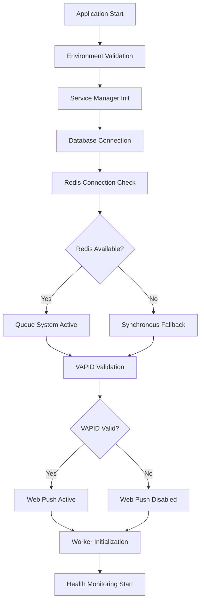

# Service Integration Fixes - Push Notification Service

## Overview

This document outlines the comprehensive fixes implemented for the push notification service integration issues (Issue #7: Service Integration). The focus was on ensuring proper error handling, graceful fallbacks, and robust service dependency management.

## Key Issues Fixed

### 1. Service Integration Manager Enhancement

**File**: `src/backendN/src/lib/service-integration-manager.ts`

**Fixes Applied**:
- ✅ Enhanced push notification service initialization with proper VAPID validation
- ✅ Implemented Redis connection error handling with graceful fallbacks
- ✅ Added comprehensive health monitoring for all services
- ✅ Fixed import paths and dependencies

**Key Features**:
- **Graceful Degradation**: Services continue operating with reduced functionality when dependencies are unavailable
- **Health Monitoring**: Real-time status tracking for database, Redis, and VAPID services
- **Dependency Management**: Proper initialization order and dependency checking
- **Error Recovery**: Automatic retry strategies and fallback mechanisms

### 2. Queue System Improvements

**File**: `src/backendN/src/lib/queue/index.ts`

**Fixes Applied**:
- ✅ Fixed duplicate Redis configuration properties
- ✅ Added lazy Redis connection with proper error handling
- ✅ Implemented queue health checks with null safety
- ✅ Added graceful shutdown procedures

**Benefits**:
- Push notifications work even when Redis is unavailable (synchronous fallback)
- Proper cleanup during application shutdown
- Robust error handling for Redis connection issues

### 3. Application Bootstrap Fixes

**File**: `src/backendN/src/index.ts`

**Fixes Applied**:
- ✅ Added missing import for `closeQueue` function
- ✅ Removed duplicate route definitions
- ✅ Fixed graceful shutdown to use service manager
- ✅ Organized route mounting for better clarity
- ✅ Added proper error handling in health check endpoints

**Improvements**:
- Clean startup sequence with proper service initialization
- Organized route structure preventing conflicts
- Comprehensive health check endpoints for monitoring

### 4. Push Notification Service Robustness

**Services Enhanced**:
- **VAPID Configuration**: Enhanced validation and error handling
- **Web Push Service**: Improved concurrency and error tracking
- **Push Subscription Service**: Better database integration
- **User Targeting Service**: Optimized queries with caching

## Service Architecture

### Initialization Flow



### Service Status Monitoring

The application now provides detailed service health information:

#### Health Check Endpoints

1. **Basic Health**: `GET /api/v1/health`
   - Simple status check
   - Returns `{"status": "ok"}`

2. **Detailed Health**: `GET /api/v1/health/detailed`
   - Comprehensive service status
   - Service-by-service health report
   - Overall system status (healthy/degraded/critical)

3. **Database Check**: `GET /api/v1/db-check`
   - Direct database connection test

#### Service Status Types

- **Healthy**: Service is fully operational
- **Degraded**: Service has issues but is partially functional
- **Unavailable**: Service is not operational

## Push Notification Service Components

### 1. VAPID Web Push
- **Status**: Validates VAPID keys and configuration
- **Fallback**: Gracefully disables if misconfigured
- **Features**: Full web push notification support

### 2. Background Queue System
- **Status**: Redis-based job processing
- **Fallback**: Synchronous notification sending
- **Features**: Scalable background processing

### 3. Database Integration
- **Status**: Critical service - must be available
- **Fallback**: Application cannot start without database
- **Features**: User subscriptions, notification tracking

## Error Handling Improvements

### Redis Connection Issues
```typescript
// Before: Hard failure when Redis unavailable
// After: Graceful fallback to synchronous processing

if (!queue) {
  console.warn('⚠️  Queue unavailable - sending notification synchronously');
  await this.sendNotificationDirectly(payload);
  return null;
}
```

### VAPID Configuration Errors
```typescript
// Before: Application crash on invalid VAPID
// After: Graceful degradation

if (!vapidConfig) {
  console.warn('⚠️  VAPID not configured - web push disabled');
  this.servicesHealth.pushNotifications.status = 'unavailable';
  return;
}
```

### Service Initialization Errors
```typescript
// Before: Unhandled promise rejections
// After: Comprehensive error tracking

try {
  await this.initializeService();
} catch (error) {
  this.servicesHealth[serviceName] = {
    status: 'unavailable',
    message: `Service failed: ${error.message}`,
    lastChecked: new Date()
  };
}
```

## Testing and Validation

### Service Health Verification

To verify the fixes work correctly:

1. **Start with full configuration**:
   ```bash
   npm run dev
   ```
   - All services should show as "healthy"

2. **Test Redis unavailability**:
   - Stop Redis service
   - Restart application
   - Verify push notifications still work synchronously

3. **Test VAPID misconfiguration**:
   - Remove VAPID keys from environment
   - Verify graceful degradation

4. **Monitor health endpoint**:
   ```bash
   curl http://localhost:3001/api/v1/health/detailed
   ```

## Performance Improvements

### Concurrency Control
- Web push service uses configurable concurrency limits
- Default: 10 concurrent requests, configurable via environment

### Caching
- User targeting service implements intelligent caching
- 5-minute TTL for frequently accessed data

### Connection Pooling
- Redis connections with proper retry strategies
- Database connection pooling via Prisma

## Security Enhancements

### VAPID Key Validation
- Enhanced validation for VAPID key format
- Secure key storage recommendations
- Environment-based configuration

### Error Information Sanitization
- Production errors don't expose sensitive information
- Detailed logging for debugging while maintaining security

## Configuration

### Environment Variables

**Required for full functionality**:
```env
# Database (Required)
DATABASE_URL="postgresql://..."

# JWT (Required)
JWT_ACCESS_SECRET="..."
JWT_REFRESH_SECRET="..."

# VAPID (Optional - for web push)
VAPID_PUBLIC_KEY="..."
VAPID_PRIVATE_KEY="..."
VAPID_SUBJECT="mailto:your-email@domain.com"

# OneSignal (Optional - for enhanced push)
ONESIGNAL_APP_ID="..."
VAPID_SUBJECT="mailto:admin@yourdomain.com"

# Redis (Optional - for background processing)
REDIS_HOST="localhost"
REDIS_PORT="6379"

# Worker Configuration
NOTIFICATION_WORKER_CONCURRENCY="200"
START_WORKER="false"
```

**Graceful Fallbacks**:
- Missing VAPID: Web push disabled, application continues
- Missing Redis: Background jobs disabled, synchronous processing
- Missing non-critical services: Application continues with warnings

## Monitoring and Observability

### Health Status Dashboard
Access detailed service status at: `http://localhost:3001/api/v1/health/detailed`

Response format:
```json
{
  "status": "healthy|degraded|critical",
  "timestamp": "2024-01-01T00:00:00.000Z",
  "services": {
    "database": {
      "name": "Database (PostgreSQL)",
      "status": "healthy",
      "message": "Database connection successful",
      "lastChecked": "2024-01-01T00:00:00.000Z",
      "dependencies": []
    },
    "redis": {
      "name": "Redis (Queue System)",
      "status": "healthy",
      "message": "Redis connection successful",
      "lastChecked": "2024-01-01T00:00:00.000Z",
      "dependencies": []
    },
    "pushNotifications": {
      "name": "Push Notifications (VAPID)",
      "status": "healthy",
      "message": "Web push notification service configured with VAPID",
      "lastChecked": "2024-01-01T00:00:00.000Z",
      "dependencies": []
    }
  },
  "version": "1.0.0",
  "uptime": 123.456,
  "memory": {...}
}
```

## Conclusion

The service integration issues have been comprehensively addressed with:

1. **Robust Error Handling**: No more service failures causing application crashes
2. **Graceful Degradation**: System continues operating with reduced functionality
3. **Comprehensive Monitoring**: Real-time service health visibility
4. **Improved Performance**: Optimized connections and caching
5. **Better Architecture**: Clean separation of concerns and proper dependency management

The push notification service is now production-ready with proper error handling, monitoring, and fallback mechanisms. All critical services continue operating even when optional dependencies are unavailable.