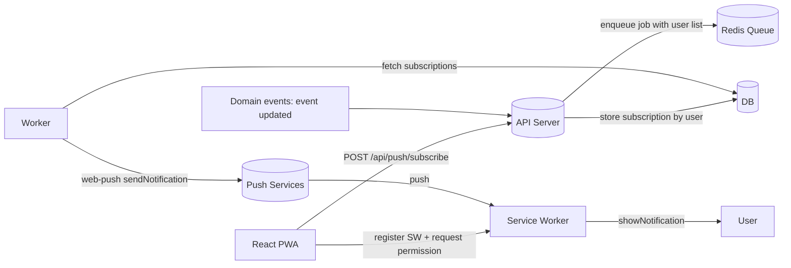

# Web Push Notifications for Ticketed Events

This document specifies how to implement Web Push notifications using VAPID for a PWA built with React on the client and Node.js on the backend. Focus: notifying all devices of users who hold a valid ticket when an event changes.

---

## Scope
- Persist browser push subscriptions per user.
- Fan-out notifications to all subscriptions of users who have valid tickets for a given event.
- Handle lifecycle: subscribe, renew, unsubscribe, cleanup on 404 or 410.
- Provide minimal HTTP API and a background worker for large fan-outs.
- Use VAPID for Web Push authentication.

Out of scope: email and SMS fallback, rich analytics, and UI for preferences. Hooks are provided.

---

## Architecture



Key points
- All user-device subscriptions are stored server side and tied to userId.
- Server decides the target audience using ticket ownership.
- Large sends use a background worker with concurrency limits.

---

## Prerequisites
- HTTPS in production.
- Service Worker served from the origin root path.
- iOS 16.4 or higher for PWA installed to Home Screen.
- VAPID key pair.

Environment variables
```
VAPID_PUBLIC_KEY=BP...
VAPID_PRIVATE_KEY=9a...
VAPID_SUBJECT=mailto:ops@example.com
REDIS_URL=redis://localhost:6379
```

Dependencies
```
npm i web-push p-limit zod
npm i bullmq ioredis
```

---

## Data Model

Prisma example
```prisma
model User {
  id         String  @id @default(cuid())
  email      String  @unique
  tickets    Ticket[]
  pushSubs   PushSubscription[]
}

model Event {
  id         String  @id @default(cuid())
  slug       String  @unique
  title      String
  startsAt   DateTime
  tickets    Ticket[]
}

enum TicketStatus { VALID REFUNDED CANCELED }

model Ticket {
  id         String  @id @default(cuid())
  userId     String
  eventId    String
  status     TicketStatus @default(VALID)
  user       User   @relation(fields: [userId], references: [id])
  event      Event  @relation(fields: [eventId], references: [id])
  @@index([eventId, status])
  @@index([userId])
}

model PushSubscription {
  id         String  @id @default(cuid())
  userId     String
  endpoint   String  @unique
  p256dh     String
  auth       String
  ua         String?
  enabled    Boolean @default(true)
  createdAt  DateTime @default(now())
  lastSeenAt DateTime @default(now())
  user       User @relation(fields: [userId], references: [id])
  @@index([userId, enabled])
}
```

Indexes ensure fast lookups by event and user.

---

## Notification Payload Contract
This is the JSON you will send through Web Push and that the Service Worker will read.

```json
{
  "type": "event_update",
  "eventId": "evt_123",
  "title": "Event updated",
  "body": "Start time changed to 19:30",
  "url": "/events/evt_123",
  "icon": "/icons/notify.png",
  "badge": "/icons/badge.png",
  "actions": [{ "action": "open", "title": "View" }],
  "change": { "field": "startsAt", "old": "2025-09-01T18:00:00Z", "new": "2025-09-01T16:30:00Z" }
}
```

Constraints
- Payload size should stay under 4 KB. Send identifiers and fetch details in app if needed.
- Use `topic` to collapse multiple updates for the same event on the same device.

---

## Service Worker Contract

Minimal handler
```js
self.addEventListener('push', event => {
  const d = event.data ? event.data.json() : {};
  const title = d.title || 'Update';
  event.waitUntil(self.registration.showNotification(title, {
    body: d.body || '',
    icon: d.icon || '/icons/icon-192.png',
    badge: d.badge || '/icons/badge-72.png',
    data: { url: d.url || '/', eventId: d.eventId },
    actions: d.actions || [{ action: 'open', title: 'Open' }],
    requireInteraction: false
  }));
});

self.addEventListener('notificationclick', event => {
  event.notification.close();
  const target = event.notification.data?.url || '/';
  event.waitUntil((async () => {
    const all = await clients.matchAll({ type: 'window', includeUncontrolled: true });
    const origin = self.location.origin;
    const abs = new URL(target, origin).href;
    for (const c of all) { if (c.url === abs && 'focus' in c) return c.focus(); }
    return clients.openWindow(abs);
  })());
});
```

---

## Backend Setup

### 1. Web Push module
```ts
// src/push/webpush.ts
import webpush from 'web-push';

const { VAPID_PUBLIC_KEY, VAPID_PRIVATE_KEY, VAPID_SUBJECT } = process.env;
if (!VAPID_PUBLIC_KEY || !VAPID_PRIVATE_KEY || !VAPID_SUBJECT) {
  throw new Error('VAPID env vars missing');
}

webpush.setVapidDetails(VAPID_SUBJECT, VAPID_PUBLIC_KEY, VAPID_PRIVATE_KEY);

export function sendWebPush(subscription: any, payload: object, opts?: {
  ttl?: number; urgency?: 'very-low'|'low'|'normal'|'high'; topic?: string;
}) {
  return webpush.sendNotification(
    subscription,
    JSON.stringify(payload),
    { TTL: opts?.ttl ?? 3600, urgency: opts?.urgency ?? 'high', topic: opts?.topic }
  );
}
```

### 2. Subscribe endpoints
Assumes user is authenticated.

```ts
// src/routes/push.ts
import { Router } from 'express';
import { z } from 'zod';
import { prisma } from '../lib/prisma.js';

const router = Router();

router.get('/push/public-key', (req, res) => {
  res.json({ publicKey: process.env.VAPID_PUBLIC_KEY });
});

const SubSchema = z.object({
  endpoint: z.string().url(),
  expirationTime: z.number().nullable().optional(),
  keys: z.object({ p256dh: z.string(), auth: z.string() })
});

router.post('/push/subscribe', async (req: any, res) => {
  const sub = SubSchema.parse(req.body);
  const userId = req.user.id; // from auth middleware
  await prisma.pushSubscription.upsert({
    where: { endpoint: sub.endpoint },
    create: { userId, endpoint: sub.endpoint, p256dh: sub.keys.p256dh, auth: sub.keys.auth, ua: req.headers['user-agent'] || '' },
    update: { p256dh: sub.keys.p256dh, auth: sub.keys.auth, enabled: true, lastSeenAt: new Date() }
  });
  res.status(201).json({ ok: true });
});

router.delete('/push/subscribe', async (req: any, res) => {
  const sub = SubSchema.parse(req.body);
  await prisma.pushSubscription.update({ where: { endpoint: sub.endpoint }, data: { enabled: false } }).catch(() => {});
  res.json({ ok: true });
});

export default router;
```

Security notes
- Tie each subscription to the authenticated user.
- Disable on logout if you can call `subscription.unsubscribe()` from client and POST to delete.

### 3. Domain trigger endpoint
For admin or internal use. It creates a job rather than sending synchronously.

```ts
// src/routes/event-notify.ts
import { Router } from 'express';
import { Queue } from 'bullmq';

const router = Router();
const notifyQueue = new Queue('event-notify', { connection: { url: process.env.REDIS_URL! } });

router.post('/events/:eventId/notify', async (req, res) => {
  const { eventId } = req.params;
  const payload = req.body; // validate if exposed externally
  await notifyQueue.add('event-update', { eventId, payload }, { attempts: 3, backoff: { type: 'exponential', delay: 2000 } });
  res.status(202).json({ enqueued: true });
});

export default router;
```

### 4. Worker for fan-out

```ts
// src/workers/event-notify.worker.ts
import { Worker, QueueEvents, Job } from 'bullmq';
import { prisma } from '../lib/prisma.js';
import { sendWebPush } from '../push/webpush.js';
import pLimit from 'p-limit';

const concurrency = Number(process.env.PUSH_CONCURRENCY || 200);

async function fetchSubsForEvent(eventId: string) {
  return prisma.pushSubscription.findMany({
    where: { enabled: true, user: { tickets: { some: { eventId, status: 'VALID' } } } },
    select: { endpoint: true, p256dh: true, auth: true }
  });
}

async function sendToMany(eventId: string, subs: any[], payload: any) {
  const limit = pLimit(concurrency);
  const topic = `event:${eventId}:update`;
  const results = await Promise.allSettled(
    subs.map(s => limit(() => sendWebPush({ endpoint: s.endpoint, keys: { p256dh: s.p256dh, auth: s.auth } }, payload, { ttl: 3600, urgency: 'high', topic })))
  );

  // Cleanup invalid endpoints
  await Promise.all(results.map(async r => {
    if (r.status === 'rejected') {
      const err: any = r.reason;
      const code = err?.statusCode;
      if (code === 404 || code === 410) {
        const endpoint = err?.endpoint || err?.body?.endpoint;
        if (endpoint) await prisma.pushSubscription.delete({ where: { endpoint } }).catch(() => {});
      }
    }
  }));

  return {
    sent: results.filter(r => r.status === 'fulfilled').length,
    failed: results.filter(r => r.status === 'rejected').length
  };
}

export const worker = new Worker('event-notify', async (job: Job) => {
  const { eventId, payload } = job.data as { eventId: string; payload: any };
  const subs = await fetchSubsForEvent(eventId);
  return sendToMany(eventId, subs, payload);
}, { connection: { url: process.env.REDIS_URL! } });

export const events = new QueueEvents('event-notify', { connection: { url: process.env.REDIS_URL! } });
```

Logging and metrics
- Log job id, eventId, targets, sent, failed.
- Track average send latency and failure rates.

---

## Event Change Integration
When an event changes in your domain layer, enqueue a job.

```ts
// domain/events/service.ts
import { Queue } from 'bullmq';
const notifyQueue = new Queue('event-notify', { connection: { url: process.env.REDIS_URL! } });

export async function onEventUpdated(eventId: string, change: { field: string; old: any; new: any }) {
  const payload = {
    type: 'event_update',
    eventId,
    title: 'Event updated',
    body: `${change.field} changed`,
    url: `/events/${eventId}`,
    change
  };
  await notifyQueue.add('event-update', { eventId, payload }, { attempts: 3, backoff: { type: 'exponential', delay: 2000 } });
}
```

---

## TTL, Urgency, and Collapse
- Use `urgency: 'high'` for time sensitive changes.
- Use `TTL` to define message lifetime. Examples
  - Time change within 24 hours: TTL 3600
  - Minor description update: TTL 86400 with `urgency: 'low'`
- Use `topic = event:<id>:update` so older messages collapse on device.

---

## Permissions and Targeting
- Only users with tickets in `VALID` status should receive pushes.
- Handle multi-device by storing all subscriptions per user.
- If the user disables notifications, set `enabled=false` for the subscription.
- Provide a future user setting to opt out per event or per notification type.

---

## Error Handling and Cleanup
- `web-push` rejects with `statusCode` field when the endpoint is invalid.
  - `404` or `410`: delete the subscription record.
  - `413`: payload too large. Trim payload.
  - `429`: rate limited by push service. Backoff and retry once.
- Always wrap send in `Promise.allSettled` and keep the job idempotent.

Idempotency
- Use a natural idempotency key per event change if needed. Example: `event:<id>:<updatedAt>`.
- Store a small dedupe table if the domain layer may fire duplicates.

---

## Security
- Store VAPID private key only on the server. Never ship to client.
- Expose only the public key through `/push/public-key`.
- Protect admin endpoints with proper auth and CSRF protection.
- Rate limit notification trigger endpoints.
- Avoid putting PII in payloads. Use identifiers and resolve in app.

---

## Testing

Local checklist
- Serve over HTTPS or use `localhost` exception.
- Confirm Service Worker registration and `PushManager.subscribe` works.
- Verify subscription is saved with your user id.
- Fire a manual job and confirm the device receives a notification.

Curl examples
```bash
# get public key
curl http://localhost:3000/api/push/public-key

# simulate a change
eventId=evt_123
curl -X POST http://localhost:3000/api/events/$eventId/notify \
  -H 'Content-Type: application/json' \
  -d '{
    "title": "Start time changed",
    "body": "New time 19:30",
    "url": "/events/'"$eventId"'",
    "type": "event_update",
    "eventId": "'"$eventId"'"
  }'
```

Automated tests
- Mock `web-push.sendNotification` and assert fan-out logic.
- Unit test subscription upsert flow.
- Integration test worker with in-memory Redis or a test container.

---

## Performance
- Use a background worker with concurrency 100 to 500 depending on CPU and network.
- Batch read subscriptions in pages if needed.
- Monitor queue lag and time to deliver.
- Consider multiple workers behind the same queue for horizontal scale.

---

## Compatibility Notes
- Chrome, Edge, Firefox support Web Push on desktop and Android.
- iOS requires PWA installed to Home Screen and iOS 16.4 or higher.
- Safari has its own quirks with actions. Test fallback behavior.

---

## Extensions
- Preferences per event and per notification type.
- Quiet hours respecting user timezone.
- Analytics sink counting deliveries and clicks using `notificationclick` events routed to your API.
- Multi-tenant support add `tenantId` to records and topics.

---

## Migration Plan
1. Deploy DB migrations for `PushSubscription`.
2. Add `/push/public-key`, `/push/subscribe`, and `/events/:eventId/notify` endpoints.
3. Deploy Service Worker and client subscription UI in the PWA.
4. Launch worker and verify with a small internal cohort.
5. Add cleanup on 404 and 410.
6. Add alerting on failure rate spikes.

---

## Appendix A. Client Subscription Helper

```ts
// urlBase64ToUint8Array and ensurePushSubscription helper
function urlBase64ToUint8Array(base64: string) {
  const padding = '='.repeat((4 - (base64.length % 4)) % 4);
  const b64 = (base64 + padding).replace(/-/g, '+').replace(/_/g, '/');
  const raw = atob(b64);
  const out = new Uint8Array(raw.length);
  for (let i = 0; i < raw.length; i++) out[i] = raw.charCodeAt(i);
  return out;
}

export async function ensurePushSubscription(publicKey: string) {
  if (!('serviceWorker' in navigator) || !('PushManager' in window)) throw new Error('Push not supported');
  const reg = await navigator.serviceWorker.register('/sw.js');
  const perm = await Notification.requestPermission();
  if (perm !== 'granted') throw new Error('Permission denied');
  const sub = await reg.pushManager.subscribe({ userVisibleOnly: true, applicationServerKey: urlBase64ToUint8Array(publicKey) });
  await fetch('/api/push/subscribe', { method: 'POST', headers: { 'Content-Type': 'application/json' }, body: JSON.stringify(sub), credentials: 'include' });
  return sub;
}
```

---

## Appendix B. Common Pitfalls
- Service Worker not at root path, subscription fails silently.
- Using the private VAPID key on the client, never do this.
- Not cleaning 404 or 410 endpoints, leads to wasted sends.
- Oversized payloads over 4 KB, results in 413.
- Asking for permission without user gesture, browsers may block dialogs.

---

## Ready To Build
Code blocks are production oriented but you will still need to integrate with your auth middleware and logging. Keep the payload small, use topics for collapse, and back off on errors. If the event volume grows, add more workers and shard by event id. Good to go.

