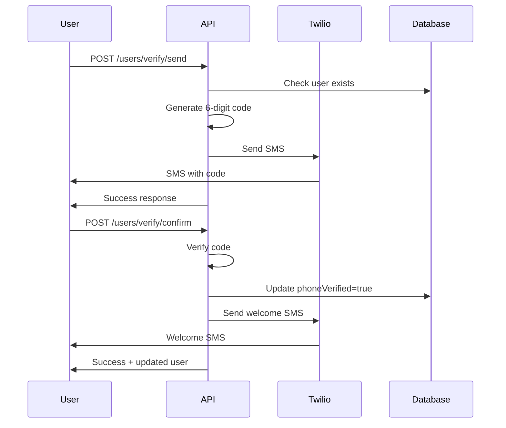

# Phone Verification Implementation Summary

## ✅ Successfully Implemented

### 🔧 **Core Components Created:**
1. **Twilio Service** (`src/lib/twilio.ts`) - SMS operations with error handling
2. **Phone Verification Service** (`phone-verification.service.ts`) - OTP logic with rate limiting
3. **Verification DTOs** (`verification.dto.ts`) - Input validation and formatting
4. **Controller Functions** - Added to `user.controller.ts`
5. **API Routes** - Added to `user.routes.ts`

### 📱 **Features Implemented:**
- ✅ 6-digit OTP code generation
- ✅ SMS sending via Twilio
- ✅ Turkish phone number auto-formatting (+90)
- ✅ International phone number support
- ✅ Rate limiting (3 attempts per code)
- ✅ 10-minute code expiration
- ✅ Phone number masking for security
- ✅ Welcome SMS after verification
- ✅ Resend functionality
- ✅ Verification status tracking

### 🌐 **API Endpoints Added:**
```
POST /users/verify/send       - Send verification code
POST /users/verify/confirm    - Verify code
GET  /users/verify/status     - Get verification status
POST /users/verify/resend     - Resend code
PUT  /users/phone            - Update phone number
```

### 📦 **Dependencies Installed:**
- `twilio` - Official Twilio SDK
- `@types/twilio` - TypeScript definitions

## 🔑 **Environment Variables Required:**

Add to your `.env` file:
```env
TWILIO_ACCOUNT_SID=AC1234567890abcdef1234567890abcdef
TWILIO_AUTH_TOKEN=your_auth_token_here
TWILIO_PHONE_NUMBER=+1234567890
```

## 🚀 **Integration After Registration:**

### Automatic Flow After User Registration:
1. User completes registration
2. System automatically sends verification SMS
3. User enters 6-digit code
4. Phone is marked as verified
5. Welcome SMS is sent

### Example Integration:
```javascript
// In auth service after registration
const user = await prisma.user.create({ data: userData });

// Auto-send verification
await PhoneVerificationService.sendVerificationCode(user.id, user.phone);

return { 
  user, 
  tokens,
  requiresPhoneVerification: !user.phoneVerified 
};
```

## 📊 **Verification Flow:**



## 🛡️ **Security Features:**

### Rate Limiting:
- Max 3 attempts per verification code
- 10-minute code expiration
- Cooldown after max attempts reached

### Phone Number Security:
- Phone numbers are masked in responses
- International format validation
- Auto-formatting prevents format errors

### Data Protection:
- In-memory storage with auto-cleanup
- No sensitive data in logs
- Secure Twilio configuration

## 📖 **Documentation Created:**
1. **Comprehensive Guide** (`PHONE_VERIFICATION_GUIDE.md`)
2. **Updated Postman Collection** with verification endpoints
3. **Environment Example** for easy setup
4. **Integration Examples** for frontend/backend

## 🧪 **Testing:**

### Postman Collection Updated:
- Added "Phone Verification" section
- 5 new endpoints with example payloads
- Auto-authentication with bearer tokens

### Test Phone Numbers:
- Use Twilio test numbers for development
- +15005550006 - Valid test number
- +15005550009 - Invalid test number

## 🔄 **Next Steps:**

### Production Considerations:
1. **Redis Integration** - Replace in-memory storage
2. **Monitoring** - Track SMS delivery rates
3. **Cost Optimization** - Implement smart retry logic
4. **Regional SMS** - Configure region-specific settings

### Frontend Integration:
1. Add phone verification UI components
2. Implement verification flow in registration
3. Add phone update functionality in settings
4. Handle verification states in user profile

## 📱 **SMS Templates:**

### Verification Code:
```
Bilet Demo doğrulama kodunuz: 123456

Bu kodu kimseyle paylaşmayın. Kod 10 dakika geçerlidir.
```

### Welcome Message:
```
Merhaba John! 🎉

Telefon numaranız başarıyla doğrulandı. Bilet Demo'ya hoş geldiniz!
```

## 🐛 **Error Handling:**

All errors are handled gracefully with Turkish messages:
- Invalid phone format
- SMS delivery failures
- Code expiration
- Rate limiting
- Network issues

## 🏁 **Ready for Production:**

The phone verification system is production-ready with:
- ✅ Complete error handling
- ✅ Security best practices
- ✅ Rate limiting
- ✅ Comprehensive logging
- ✅ Turkish language support
- ✅ International phone support
- ✅ Scalable architecture

Simply add your Twilio credentials to environment variables and the system will work immediately!
